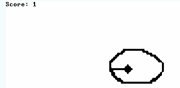

# From Nand To Tetris
Nand2Tetris：从头开始构建计算机系统，从 nand 到 tetris（nand 是构建其他门的基本逻辑门），从硬件到软件。

感谢 Noam Nisan 教授和 Shimon Shocken 教授写了一本超级酷的书，创造了优秀的工具并教授了很棒的课程。

### [电子木鱼 project 09](projects/09/ElectronicWoodenFish)

### [project1 从nand 到逻辑门](projects/01)
实现内容:
1. 基于提供的HardWareSimulator，使用与非门(nand: ~(A and B)) 构建基础的逻辑门 And Or Not Xor Mux Dmux
2. 基于提供的HardWareSimulator和实现好的基础逻辑门，拓展实现And16 DMux4Way DMux8Way Mux16 Mux4Way16 Not16，等适用于16位计算的逻辑门chip

TESTS ALL PASS

### [project2 从逻辑门到加法器](projects/02)
实现内容:
1. 基于提供的HardWareSimulator，使用实现好的16位逻辑门拓展到加法器
    + HalfAdder(不考虑进位的加法器 a+b)
    + FullAdder(考虑进位的加法器 a+b+c)
    + Inc(+1 加法器？)
    + ALU(超级复杂的加法器!)

TESTS ALL PASS

### [project3 引入Memory！从Bit到RAM](projects/03)
实现内容:
1. 基于提供的HardWareSimulator, 以及BuildtIn的DFF(Data-Flip-Flop: 可以由两个Nand组合)构建1位的Bit的寄存器
2. 基于提供的HardWareSimulator，使用实现的Bit拓展成16位寄存器
3. 基于提供的HardWareSimulator，使用16位寄存器进一步成倍拓展成 RAM8 RAM64 RAM512 RAM4K RAM16K
4. 基于提供的HardWareSimulator，结合寄存器和Inc 拓展成PC(Program Counter)
TESTS ALL PASS

### [project4 探索RAM和外设(Input or Output)](projects/04)
课程内容:
1. 外设和RAM的关系
2. 拆解0/1的机器语言，说明各个位的实际意义
3. 介绍添加助记符的机器语言

实现内容:
1. 使用机器语言，对RAM 的Screen remapping 的区域进行操作来操作屏幕上的像素
2. 使用机器语言，对RAM 的Keyboard remapping 的区域来获取键盘上的操作
3. 使用机器语言，实现一个Simple的惩罚算法
TESTS ALL PASS

### [project5 逻辑门+时序=> CPU + RAM + ROM(Builtin) => Computer](projects/05)
课程内容:
1. 什么是ROM、Flash、EEPROM
2. RAM + ROM + CPU 的架构和成体数据通信

实现内容:
1. 按照 A寄存器(Addr registor) + D寄存器(Data registor) + PC + ALU 的架构构建 CPU 模块
2. 按照 RAM + CPU + ROM 的架构，构建Computer

TESTS ALL PASS

### [project6 Assembler(Python)](submodule/hack_assembler)
实现内容:
1. 使用Python 实现一个Assembler将助记符翻译成0/1的机器语言，结构如下:
    - assembler_io 用于文件的输入和结果的输出 输入Jack.asm 输出 Jack.asm.hack
    - assembler_parser 用于进行对文本进行拆解
    - assembler_symboltable 用于对label 和 variable 进行处理，这里对于variable 的处理将影响到后面类的static的处理
    - assembler_translator 用于将拆解后的文本翻译成0/1机器语言

TESTS ALL PASS
    
### [project7/8 两段式编译器一(Python)](submodule/vm_translator)
实现内容:
1. 使用Python 实现Compiler的偏底层部分，将VirtualMachine 码，翻译成助记符的机器语言,结构如下:
    - translator_io 用于文件的输入和结果的输出 输入Jack.vm 输出 Jack.vm.asm
    - translator_parser 将原始文本去注释和拆分
    - memory_translator 将拆分的文本翻译成能使用的机器语言

TESTS ALL PASS

### [project 9 电子木鱼](projects/09/ElectronicWoodenFish)
实现内容:
1. 使用Jack 做一个电子木鱼App
2. 原本的BitMapEditor 代码简单重构
3. 拓展原本的BitMapEditor，添加下载和加载、Resize的功能
(大工程都在学javascript了)

### [project 10/11 两段式编译器二(Python)](submodule/jack_compiler)
实现内容:
1. 使用Python 实现Compiler 的偏上层部分，将Jack语言翻译成VM码，结构如下:
    - text_io 用于文件的输入和结果的输出 输入Jack.jack 输出 Jack.vm
    - tokenizer 去除所有的注释，并对原文本进行拆分
    - grammar 将所有的拆分文本，翻译成VM 码
    - test_.*/test_material 所有的自测单元测试和自动测试材料
    - .*_modules grammar.py内部依赖的所有Handler
    
(人间噩梦)

TESTS ALL PASS

### [project 12 OS](projects/12)
实现内容:
1. 使用可翻译的Jack语言来实现需要的所有内部组件:
    - Math => multiply divide sqrt bit-operation
    - Memory => alloc dealloc peek poke
    - Array 基础类型
    - String 基础类型
    - Screen 图形输出
    - Output 文本输出
    - Sys 调用以上所有组件的init(), 并使用Sys.main() 来调用Main.main()

TEST FAILED